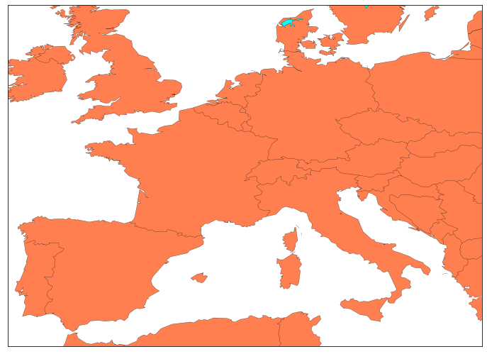
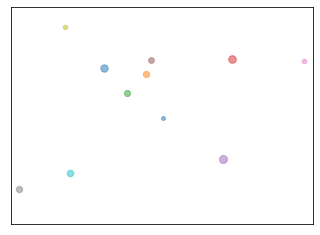

# 欧洲足球数据库分析European Soccer Database


## 项目介绍
* 25,000+球队数据
* 10,000+球员数据
* 11个欧冠国家
* 2008-2016赛季
* 球员和球队属性数据来自EA FIFA电子游戏，包括每周的更新数据

## 项目目的
* 掌握Python的数据库连接
* 分析数据库信息
* 可视化分析结果

## 涉及知识点
* 模块化项目
* python的SQLite连接
* 列表推导式、字典推导式
* dataframe数据结构
* csv数据生成
* matplotlib简单的地图可视化


```python
import zipfile
import os
import pandas as pd
import numpy as np
import sqlite3

import datetime
```


```python
import matplotlib.pyplot as plt
import mpl_toolkits.basemap as bm
```


```python
database_path='F:/some_now/source/lecture03_proj/src/database' #数据库路径，也是选择解压文件保存的位置
zip_filename='soccer.zip' #zip文件名
zip_filepath=os.path.join(database_path,zip_filename)#zip文件路径
```


```python
#函数版本的解压
def unzip(zip_filepath,dest_path):
    """
    解压zip文件
    """
    with zipfile.ZipFile(zip_filepath) as zf:
        #zf.extractall解压zip文档中的所有文件到当前目录
        zf.extractall(path=dest_path)
        
def get_dataset_filename(zip_filepath):
    """
    获取数据库文件名
    """
    with zipfile.ZipFile(zip_filepath) as zf:
        return zf.namelist()[0]
"""
#zipfile.infolist()获取zip文档内所有文件的信息，返回一个zipfile.ZipInfo的列表
print(zipfile.infolist())

#zipfile.namelist()获取zip文档内所有文件的名称列表
print(zipfile.namelist())

#zipfile.printdir()获取zip文档内所有文件的名称列表
print(zipfile.printdir())
"""

zipfile.ZipFile(zip_filepath).namelist()[0]

print(zipfile.ZipFile(zip_filepath).extractall(path=database_path))

print("解压zip...")
unzip(zip_filepath,database_path)
print("完成")
```


```python
#简单版本
import zipfile
file_dir='F:/some_now/source/lecture03_proj/src/database/soccer.zip'
zf=zipfile.ZipFile(file_dir)
```


```python
#解压
database_path='F:/some_now/source/lecture03_proj/src/database'
zf.extractall(database_path)
```


```python
#查看压缩包中的文件信息
zf.namelist()
```


```python
#取出压缩包中的第一个文件名称
database_filename=zf.namelist()[0]
database_filename
```


    'database.sqlite'


```python
database_filepath=os.path.join(database_path,database_filename)
database_filepath
```


    'F:/some_now/source/lecture03_proj/src/database\\database.sqlite'


```python
#连接数据库
conn=sqlite3.connect(database_filepath)
sql="SELECT name FROM sqlite_master WHERE type='table';"
cur=conn.cursor()
cur.execute(sql)
print(cur.fetchall())
```

    [('sqlite_sequence',), ('Player_Attributes',), ('Player',), ('Match',), ('League',), ('Country',), ('Team',), ('Team_Attributes',)]
    

con = sqlite3.connect('database.db')
cursor = con.cursor()
cursor.execute("SELECT name FROM sqlite_master WHERE type='table';")
print(cursor.fetchall())


```python
#运行task1：多表查询获取球员基本数据，保存csv，并返回该数据
#查看表Player的所有列信息
sql="PRAGMA table_info(Player) "
print(cur.execute(sql).fetchall())

```

    [(0, 'id', 'INTEGER', 0, None, 1), (1, 'player_api_id', 'INTEGER', 0, None, 0), (2, 'player_name', 'TEXT', 0, None, 0), (3, 'player_fifa_api_id', 'INTEGER', 0, None, 0), (4, 'birthday', 'TEXT', 0, None, 0), (5, 'height', 'INTEGER', 0, None, 0), (6, 'weight', 'INTEGER', 0, None, 0)]
    


```python
#分析球员的个数，根据分析时间可自行调整
max_players_to_analyze=50
sql="select * from Player LIMIT %i" %max_players_to_analyze
players=cur.execute(sql).fetchall()
```


```python
players
```


    [(1, 505942, 'Aaron Appindangoye', 218353, '1992-02-29 00:00:00', 182.88, 187),
     (2, 155782, 'Aaron Cresswell', 189615, '1989-12-15 00:00:00', 170.18, 146),
     (3, 162549, 'Aaron Doran', 186170, '1991-05-13 00:00:00', 170.18, 163),
     (4, 30572, 'Aaron Galindo', 140161, '1982-05-08 00:00:00', 182.88, 198),
     (5, 23780, 'Aaron Hughes', 17725, '1979-11-08 00:00:00', 182.88, 154),
     (6, 27316, 'Aaron Hunt', 158138, '1986-09-04 00:00:00', 182.88, 161),
     (7, 564793, 'Aaron Kuhl', 221280, '1996-01-30 00:00:00', 172.72, 146),
     (8, 30895, 'Aaron Lennon', 152747, '1987-04-16 00:00:00', 165.1, 139),
     (9, 528212, 'Aaron Lennox', 206592, '1993-02-19 00:00:00', 190.5, 181),
     (10, 101042, 'Aaron Meijers', 188621, '1987-10-28 00:00:00', 175.26, 170),
     (11, 23889, 'Aaron Mokoena', 47189, '1980-11-25 00:00:00', 182.88, 181),
     (12, 231592, 'Aaron Mooy', 194958, '1990-09-15 00:00:00', 175.26, 150),
     (13, 163222, 'Aaron Muirhead', 213568, '1990-08-30 00:00:00', 187.96, 168),
     (14, 40719, 'Aaron Niguez', 183853, '1989-04-26 00:00:00', 170.18, 143),
     (15, 75489, 'Aaron Ramsey', 186561, '1990-12-26 00:00:00', 177.8, 154),
     (16, 597948, 'Aaron Splaine', 226014, '1996-10-13 00:00:00', 172.72, 163),
     (17,
      161644,
      'Aaron Taylor-Sinclair',
      213569,
      '1991-04-08 00:00:00',
      182.88,
      176),
     (18, 23499, 'Aaron Wilbraham', 2335, '1979-10-21 00:00:00', 190.5, 159),
     (19, 120919, 'Aatif Chahechouhe', 187939, '1986-07-02 00:00:00', 175.26, 150),
     (20, 46447, 'Abasse Ba', 156626, '1976-07-12 00:00:00', 187.96, 185),
     (21, 167027, 'Abdelaziz Barrada', 192274, '1989-06-19 00:00:00', 177.8, 161),
     (22,
      245653,
      'Abdelfettah Boukhriss',
      202425,
      '1986-10-22 00:00:00',
      185.42,
      161),
     (23,
      128456,
      'Abdelhamid El Kaoutari',
      188145,
      '1990-03-17 00:00:00',
      180.34,
      161),
     (24, 42664, 'Abdelkader Ghezzal', 178063, '1984-12-05 00:00:00', 182.88, 172),
     (25, 425950, 'Abdellah Zoubir', 212934, '1991-12-05 00:00:00', 180.34, 161),
     (26, 38423, 'Abdelmajid Oulmers', 52782, '1978-09-12 00:00:00', 172.72, 143),
     (27, 3264, 'Abdelmalek Cherrad', 51868, '1981-01-14 00:00:00', 185.42, 165),
     (28,
      467485,
      'Abdelmalek El Hasnaoui',
      209399,
      '1994-02-09 00:00:00',
      180.34,
      159),
     (29,
      306735,
      'Abdelouahed Chakhsi',
      210504,
      '1986-10-01 00:00:00',
      182.88,
      170),
     (30, 41659, 'Abderrazak Jadid', 149241, '1983-06-01 00:00:00', 177.8, 157),
     (31, 31684, 'Abdeslam Ouaddou', 33022, '1978-11-01 00:00:00', 190.5, 181),
     (32,
      32637,
      'Abdessalam Benjelloun',
      177295,
      '1985-01-28 00:00:00',
      187.96,
      179),
     (33, 563215, 'Abdou Diallo', 225711, '1996-05-04 00:00:00', 182.88, 159),
     (34, 41093, 'Abdou Traore', 187048, '1988-01-17 00:00:00', 180.34, 174),
     (35, 564712, 'Abdoul Ba', 225050, '1994-02-08 00:00:00', 200.66, 212),
     (36, 67334, 'Abdoul Karim Yoda', 188232, '1988-10-25 00:00:00', 182.88, 161),
     (37,
      173955,
      'Abdoul Razzagui Camara',
      193953,
      '1990-02-20 00:00:00',
      177.8,
      157),
     (38, 39562, 'Abdoulay Konko', 161999, '1984-03-09 00:00:00', 182.88, 157),
     (39, 191784, 'Abdoulaye Ba', 204826, '1991-01-01 00:00:00', 198.12, 174),
     (40, 210400, 'Abdoulaye Bamba', 199313, '1990-04-25 00:00:00', 182.88, 150),
     (41, 201915, 'Abdoulaye Diaby', 202330, '1991-05-21 00:00:00', 172.72, 154),
     (42,
      194479,
      'Abdoulaye Diallo Sadio,22',
      204171,
      '1990-12-28 00:00:00',
      182.88,
      168),
     (43, 189181, 'Abdoulaye Diallo', 197233, '1992-03-30 00:00:00', 187.96, 174),
     (44,
      352887,
      'Abdoulaye Doucoure',
      208135,
      '1993-01-01 00:00:00',
      182.88,
      165),
     (45, 40005, 'Abdoulaye Faye', 100329, '1978-02-26 00:00:00', 187.96, 218),
     (46, 409003, 'Abdoulaye Keita', 212280, '1994-01-05 00:00:00', 175.26, 165),
     (47, 37280, 'Abdoulaye Meite', 41745, '1980-10-06 00:00:00', 185.42, 181),
     (48, 439366, 'Abdoulaye Toure', 210450, '1994-03-03 00:00:00', 187.96, 170),
     (49,
      148827,
      'Abdoulwahid Sissoko',
      189568,
      '1990-03-20 00:00:00',
      182.88,
      165),
     (50,
      173011,
      'Abdourahman Dampha',
      197901,
      '1991-12-27 00:00:00',
      182.88,
      168)]


```python
sql="SELECT COUNT(*) FROM Player"
cur = con.cursor()
print(cur.execute(sql).fetchall())

```

    [<sqlite3.Row object at 0x000001E1B6500E10>]
    


```python
con=sqlite3.connect(database_filepath)
con.row_factory = sqlite3.Row    # 返回的每行是sqlite3.Row类型，可通过列名直接访问数据
cursor = con.cursor()
```


```python
players=cursor.execute(sql).fetchall()
players
```


    [<sqlite3.Row at 0x1e1b6500f30>,
     <sqlite3.Row at 0x1e1b63b11f0>,
     <sqlite3.Row at 0x1e1b63b1270>,
     <sqlite3.Row at 0x1e1b63b12f0>,
     <sqlite3.Row at 0x1e1b63b1370>,
     <sqlite3.Row at 0x1e1b63b11d0>,
     <sqlite3.Row at 0x1e1b63b1430>,
     <sqlite3.Row at 0x1e1b63b1450>,
     <sqlite3.Row at 0x1e1b63b14d0>,
     <sqlite3.Row at 0x1e1b63b1550>,
     <sqlite3.Row at 0x1e1b63b15d0>,
     <sqlite3.Row at 0x1e1b63b1650>,
     <sqlite3.Row at 0x1e1b63b16d0>,
     <sqlite3.Row at 0x1e1b63b1750>,
     <sqlite3.Row at 0x1e1b63b17d0>,
     <sqlite3.Row at 0x1e1b63b1850>,
     <sqlite3.Row at 0x1e1b63b18d0>,
     <sqlite3.Row at 0x1e1b63b1950>,
     <sqlite3.Row at 0x1e1b63b19d0>,
     <sqlite3.Row at 0x1e1b63b1a50>,
     <sqlite3.Row at 0x1e1b63b1ad0>,
     <sqlite3.Row at 0x1e1b63b1b70>,
     <sqlite3.Row at 0x1e1b63b1c10>,
     <sqlite3.Row at 0x1e1b63b1cb0>,
     <sqlite3.Row at 0x1e1b63b1d70>,
     <sqlite3.Row at 0x1e1b63b1e10>,
     <sqlite3.Row at 0x1e1b63b1eb0>,
     <sqlite3.Row at 0x1e1b63b1f70>,
     <sqlite3.Row at 0x1e1b63b9090>,
     <sqlite3.Row at 0x1e1b63b9290>,
     <sqlite3.Row at 0x1e1b63b9490>,
     <sqlite3.Row at 0x1e1b63b9690>,
     <sqlite3.Row at 0x1e1b63b9890>,
     <sqlite3.Row at 0x1e1b63b9a90>,
     <sqlite3.Row at 0x1e1b63b9d10>,
     <sqlite3.Row at 0x1e1b63b9cd0>,
     <sqlite3.Row at 0x1e1b63b90b0>,
     <sqlite3.Row at 0x1e1b63b9150>,
     <sqlite3.Row at 0x1e1b63b91f0>,
     <sqlite3.Row at 0x1e1b63b92b0>,
     <sqlite3.Row at 0x1e1b63b9350>,
     <sqlite3.Row at 0x1e1b63b93f0>,
     <sqlite3.Row at 0x1e1b63b94b0>,
     <sqlite3.Row at 0x1e1b63b9550>,
     <sqlite3.Row at 0x1e1b63b95f0>,
     <sqlite3.Row at 0x1e1b63b96b0>,
     <sqlite3.Row at 0x1e1b63b9750>,
     <sqlite3.Row at 0x1e1b63b97f0>,
     <sqlite3.Row at 0x1e1b63b98b0>,
     <sqlite3.Row at 0x1e1b63b9950>]


```python
#球员姓名列表
player_name=[player['player_name'] for player in players]
#球员生日列表
player_birthday=[player['birthday'] for player in players]
#体重列表
player_weight=[player['weight'] for player in players]
```


```python
# 身高列表
player_height = [player['height'] for player in players]
```


```python
player_birthday
```


    ['1992-02-29 00:00:00',
     '1989-12-15 00:00:00',
     '1991-05-13 00:00:00',
     '1982-05-08 00:00:00',
     '1979-11-08 00:00:00',
     '1986-09-04 00:00:00',
     '1996-01-30 00:00:00',
     '1987-04-16 00:00:00',
     '1993-02-19 00:00:00',
     '1987-10-28 00:00:00',
     '1980-11-25 00:00:00',
     '1990-09-15 00:00:00',
     '1990-08-30 00:00:00',
     '1989-04-26 00:00:00',
     '1990-12-26 00:00:00',
     '1996-10-13 00:00:00',
     '1991-04-08 00:00:00',
     '1979-10-21 00:00:00',
     '1986-07-02 00:00:00',
     '1976-07-12 00:00:00',
     '1989-06-19 00:00:00',
     '1986-10-22 00:00:00',
     '1990-03-17 00:00:00',
     '1984-12-05 00:00:00',
     '1991-12-05 00:00:00',
     '1978-09-12 00:00:00',
     '1981-01-14 00:00:00',
     '1994-02-09 00:00:00',
     '1986-10-01 00:00:00',
     '1983-06-01 00:00:00',
     '1978-11-01 00:00:00',
     '1985-01-28 00:00:00',
     '1996-05-04 00:00:00',
     '1988-01-17 00:00:00',
     '1994-02-08 00:00:00',
     '1988-10-25 00:00:00',
     '1990-02-20 00:00:00',
     '1984-03-09 00:00:00',
     '1991-01-01 00:00:00',
     '1990-04-25 00:00:00',
     '1991-05-21 00:00:00',
     '1990-12-28 00:00:00',
     '1992-03-30 00:00:00',
     '1993-01-01 00:00:00',
     '1978-02-26 00:00:00',
     '1994-01-05 00:00:00',
     '1980-10-06 00:00:00',
     '1994-03-03 00:00:00',
     '1990-03-20 00:00:00',
     '1991-12-27 00:00:00']


```python
len(player_birthday)
```


    50


```python
from datetime import datetime
datetime.now()
```


    datetime.datetime(2020, 6, 17, 15, 34, 51, 67525)


```python
def get_age(bir_str):
    """
    获取球员年龄
    """
    date=bir_str.split(" ")[0]
    today = datetime.strptime("2020-06-01", "%Y-%m-%d").date()
    born=datetime.strptime(date,"%Y-%m-%d").date()
    return today.year-born.year-((today.month,today.day)<(born.month,born.day))
```


```python
#获取年龄列表
player_age=map(get_age,player_birthday)
player_age
```


    <map at 0x1e1b62b0248>


```python
def get_rating(cursor,player_api_id):
    """
    获取球员平均评分
    """
    all_rating=cursor.execute("SELECT overall_rating FROM Player_Attributes WHERE player_api_id = '%d' " %
                              player_api_id).fetchall()
    all_rating=np.array(all_rating,dtype=np.float)[:,0]
    mean_rating=np.nanmean(all_rating)
    return mean_rating
    
```


```python
#获取平均评分列表
player_rating=[get_rating(cursor,player['player_api_id']) for player in players]
player_rating
```


    [63.6,
     66.96969696969697,
     67.0,
     69.08695652173913,
     73.24,
     77.25925925925925,
     60.57142857142857,
     79.76923076923077,
     48.0,
     67.05263157894737,
     71.625,
     66.28571428571429,
     62.25,
     66.92592592592592,
     78.5,
     54.625,
     62.611111111111114,
     61.77272727272727,
     69.375,
     65.6,
     71.85714285714286,
     64.0,
     68.28571428571429,
     68.6923076923077,
     59.0,
     68.8,
     61.6,
     63.0,
     54.333333333333336,
     63.30769230769231,
     76.6,
     63.333333333333336,
     63.1,
     67.48,
     63.285714285714285,
     62.77272727272727,
     68.29166666666667,
     74.93548387096774,
     70.58064516129032,
     65.33333333333333,
     68.3,
     72.0,
     65.26315789473684,
     64.61111111111111,
     72.2,
     60.0,
     69.54545454545455,
     59.857142857142854,
     64.61904761904762,
     59.44444444444444]


```python
conn=sqlite3.connect(database_filepath)
sql="PRAGMA table_info(Player_Attributes) "
cur=conn.cursor()
cur.execute(sql).fetchall()

```


    [(0, 'id', 'INTEGER', 0, None, 1),
     (1, 'player_fifa_api_id', 'INTEGER', 0, None, 0),
     (2, 'player_api_id', 'INTEGER', 0, None, 0),
     (3, 'date', 'TEXT', 0, None, 0),
     (4, 'overall_rating', 'INTEGER', 0, None, 0),
     (5, 'potential', 'INTEGER', 0, None, 0),
     (6, 'preferred_foot', 'TEXT', 0, None, 0),
     (7, 'attacking_work_rate', 'TEXT', 0, None, 0),
     (8, 'defensive_work_rate', 'TEXT', 0, None, 0),
     (9, 'crossing', 'INTEGER', 0, None, 0),
     (10, 'finishing', 'INTEGER', 0, None, 0),
     (11, 'heading_accuracy', 'INTEGER', 0, None, 0),
     (12, 'short_passing', 'INTEGER', 0, None, 0),
     (13, 'volleys', 'INTEGER', 0, None, 0),
     (14, 'dribbling', 'INTEGER', 0, None, 0),
     (15, 'curve', 'INTEGER', 0, None, 0),
     (16, 'free_kick_accuracy', 'INTEGER', 0, None, 0),
     (17, 'long_passing', 'INTEGER', 0, None, 0),
     (18, 'ball_control', 'INTEGER', 0, None, 0),
     (19, 'acceleration', 'INTEGER', 0, None, 0),
     (20, 'sprint_speed', 'INTEGER', 0, None, 0),
     (21, 'agility', 'INTEGER', 0, None, 0),
     (22, 'reactions', 'INTEGER', 0, None, 0),
     (23, 'balance', 'INTEGER', 0, None, 0),
     (24, 'shot_power', 'INTEGER', 0, None, 0),
     (25, 'jumping', 'INTEGER', 0, None, 0),
     (26, 'stamina', 'INTEGER', 0, None, 0),
     (27, 'strength', 'INTEGER', 0, None, 0),
     (28, 'long_shots', 'INTEGER', 0, None, 0),
     (29, 'aggression', 'INTEGER', 0, None, 0),
     (30, 'interceptions', 'INTEGER', 0, None, 0),
     (31, 'positioning', 'INTEGER', 0, None, 0),
     (32, 'vision', 'INTEGER', 0, None, 0),
     (33, 'penalties', 'INTEGER', 0, None, 0),
     (34, 'marking', 'INTEGER', 0, None, 0),
     (35, 'standing_tackle', 'INTEGER', 0, None, 0),
     (36, 'sliding_tackle', 'INTEGER', 0, None, 0),
     (37, 'gk_diving', 'INTEGER', 0, None, 0),
     (38, 'gk_handling', 'INTEGER', 0, None, 0),
     (39, 'gk_kicking', 'INTEGER', 0, None, 0),
     (40, 'gk_positioning', 'INTEGER', 0, None, 0),
     (41, 'gk_reflexes', 'INTEGER', 0, None, 0)]


```python
conn=sqlite3.connect(database_filepath)
sql="PRAGMA table_info(Match) "
cur=conn.cursor()
cur.execute(sql).fetchall()
```


    [(0, 'id', 'INTEGER', 0, None, 1),
     (1, 'country_id', 'INTEGER', 0, None, 0),
     (2, 'league_id', 'INTEGER', 0, None, 0),
     (3, 'season', 'TEXT', 0, None, 0),
     (4, 'stage', 'INTEGER', 0, None, 0),
     (5, 'date', 'TEXT', 0, None, 0),
     (6, 'match_api_id', 'INTEGER', 0, None, 0),
     (7, 'home_team_api_id', 'INTEGER', 0, None, 0),
     (8, 'away_team_api_id', 'INTEGER', 0, None, 0),
     (9, 'home_team_goal', 'INTEGER', 0, None, 0),
     (10, 'away_team_goal', 'INTEGER', 0, None, 0),
     (11, 'home_player_X1', 'INTEGER', 0, None, 0),
     (12, 'home_player_X2', 'INTEGER', 0, None, 0),
     (13, 'home_player_X3', 'INTEGER', 0, None, 0),
     (14, 'home_player_X4', 'INTEGER', 0, None, 0),
     (15, 'home_player_X5', 'INTEGER', 0, None, 0),
     (16, 'home_player_X6', 'INTEGER', 0, None, 0),
     (17, 'home_player_X7', 'INTEGER', 0, None, 0),
     (18, 'home_player_X8', 'INTEGER', 0, None, 0),
     (19, 'home_player_X9', 'INTEGER', 0, None, 0),
     (20, 'home_player_X10', 'INTEGER', 0, None, 0),
     (21, 'home_player_X11', 'INTEGER', 0, None, 0),
     (22, 'away_player_X1', 'INTEGER', 0, None, 0),
     (23, 'away_player_X2', 'INTEGER', 0, None, 0),
     (24, 'away_player_X3', 'INTEGER', 0, None, 0),
     (25, 'away_player_X4', 'INTEGER', 0, None, 0),
     (26, 'away_player_X5', 'INTEGER', 0, None, 0),
     (27, 'away_player_X6', 'INTEGER', 0, None, 0),
     (28, 'away_player_X7', 'INTEGER', 0, None, 0),
     (29, 'away_player_X8', 'INTEGER', 0, None, 0),
     (30, 'away_player_X9', 'INTEGER', 0, None, 0),
     (31, 'away_player_X10', 'INTEGER', 0, None, 0),
     (32, 'away_player_X11', 'INTEGER', 0, None, 0),
     (33, 'home_player_Y1', 'INTEGER', 0, None, 0),
     (34, 'home_player_Y2', 'INTEGER', 0, None, 0),
     (35, 'home_player_Y3', 'INTEGER', 0, None, 0),
     (36, 'home_player_Y4', 'INTEGER', 0, None, 0),
     (37, 'home_player_Y5', 'INTEGER', 0, None, 0),
     (38, 'home_player_Y6', 'INTEGER', 0, None, 0),
     (39, 'home_player_Y7', 'INTEGER', 0, None, 0),
     (40, 'home_player_Y8', 'INTEGER', 0, None, 0),
     (41, 'home_player_Y9', 'INTEGER', 0, None, 0),
     (42, 'home_player_Y10', 'INTEGER', 0, None, 0),
     (43, 'home_player_Y11', 'INTEGER', 0, None, 0),
     (44, 'away_player_Y1', 'INTEGER', 0, None, 0),
     (45, 'away_player_Y2', 'INTEGER', 0, None, 0),
     (46, 'away_player_Y3', 'INTEGER', 0, None, 0),
     (47, 'away_player_Y4', 'INTEGER', 0, None, 0),
     (48, 'away_player_Y5', 'INTEGER', 0, None, 0),
     (49, 'away_player_Y6', 'INTEGER', 0, None, 0),
     (50, 'away_player_Y7', 'INTEGER', 0, None, 0),
     (51, 'away_player_Y8', 'INTEGER', 0, None, 0),
     (52, 'away_player_Y9', 'INTEGER', 0, None, 0),
     (53, 'away_player_Y10', 'INTEGER', 0, None, 0),
     (54, 'away_player_Y11', 'INTEGER', 0, None, 0),
     (55, 'home_player_1', 'INTEGER', 0, None, 0),
     (56, 'home_player_2', 'INTEGER', 0, None, 0),
     (57, 'home_player_3', 'INTEGER', 0, None, 0),
     (58, 'home_player_4', 'INTEGER', 0, None, 0),
     (59, 'home_player_5', 'INTEGER', 0, None, 0),
     (60, 'home_player_6', 'INTEGER', 0, None, 0),
     (61, 'home_player_7', 'INTEGER', 0, None, 0),
     (62, 'home_player_8', 'INTEGER', 0, None, 0),
     (63, 'home_player_9', 'INTEGER', 0, None, 0),
     (64, 'home_player_10', 'INTEGER', 0, None, 0),
     (65, 'home_player_11', 'INTEGER', 0, None, 0),
     (66, 'away_player_1', 'INTEGER', 0, None, 0),
     (67, 'away_player_2', 'INTEGER', 0, None, 0),
     (68, 'away_player_3', 'INTEGER', 0, None, 0),
     (69, 'away_player_4', 'INTEGER', 0, None, 0),
     (70, 'away_player_5', 'INTEGER', 0, None, 0),
     (71, 'away_player_6', 'INTEGER', 0, None, 0),
     (72, 'away_player_7', 'INTEGER', 0, None, 0),
     (73, 'away_player_8', 'INTEGER', 0, None, 0),
     (74, 'away_player_9', 'INTEGER', 0, None, 0),
     (75, 'away_player_10', 'INTEGER', 0, None, 0),
     (76, 'away_player_11', 'INTEGER', 0, None, 0),
     (77, 'goal', 'TEXT', 0, None, 0),
     (78, 'shoton', 'TEXT', 0, None, 0),
     (79, 'shotoff', 'TEXT', 0, None, 0),
     (80, 'foulcommit', 'TEXT', 0, None, 0),
     (81, 'card', 'TEXT', 0, None, 0),
     (82, 'cross', 'TEXT', 0, None, 0),
     (83, 'corner', 'TEXT', 0, None, 0),
     (84, 'possession', 'TEXT', 0, None, 0),
     (85, 'B365H', 'NUMERIC', 0, None, 0),
     (86, 'B365D', 'NUMERIC', 0, None, 0),
     (87, 'B365A', 'NUMERIC', 0, None, 0),
     (88, 'BWH', 'NUMERIC', 0, None, 0),
     (89, 'BWD', 'NUMERIC', 0, None, 0),
     (90, 'BWA', 'NUMERIC', 0, None, 0),
     (91, 'IWH', 'NUMERIC', 0, None, 0),
     (92, 'IWD', 'NUMERIC', 0, None, 0),
     (93, 'IWA', 'NUMERIC', 0, None, 0),
     (94, 'LBH', 'NUMERIC', 0, None, 0),
     (95, 'LBD', 'NUMERIC', 0, None, 0),
     (96, 'LBA', 'NUMERIC', 0, None, 0),
     (97, 'PSH', 'NUMERIC', 0, None, 0),
     (98, 'PSD', 'NUMERIC', 0, None, 0),
     (99, 'PSA', 'NUMERIC', 0, None, 0),
     (100, 'WHH', 'NUMERIC', 0, None, 0),
     (101, 'WHD', 'NUMERIC', 0, None, 0),
     (102, 'WHA', 'NUMERIC', 0, None, 0),
     (103, 'SJH', 'NUMERIC', 0, None, 0),
     (104, 'SJD', 'NUMERIC', 0, None, 0),
     (105, 'SJA', 'NUMERIC', 0, None, 0),
     (106, 'VCH', 'NUMERIC', 0, None, 0),
     (107, 'VCD', 'NUMERIC', 0, None, 0),
     (108, 'VCA', 'NUMERIC', 0, None, 0),
     (109, 'GBH', 'NUMERIC', 0, None, 0),
     (110, 'GBD', 'NUMERIC', 0, None, 0),
     (111, 'GBA', 'NUMERIC', 0, None, 0),
     (112, 'BSH', 'NUMERIC', 0, None, 0),
     (113, 'BSD', 'NUMERIC', 0, None, 0),
     (114, 'BSA', 'NUMERIC', 0, None, 0)]


```python
def get_current_team_and_country(cur, player_api_id):
    """
    获取当前球队及国家
    """
    all_rating=cursor.execute("select overall_rating from Player_Attributes WHERE player_api_id = '%d'"%player_api_id).fetchall()
    all_rating=np.array(all_rating,dtype=np.float)[:,0]
    rating=np.nanmean(all_rating)
    if (rating>1):
        all_football_nums=reversed(range(1,12))
        for num in all_football_nums:
            all_team_id=cursor.execute("select home_team_api_id, country_id FROM Match WHERE home_player_%d = '%d'" %
                        (num,player_api_id)).fetchall()
            if len(all_team_id)>0:
                number_unique_teams=len(np.unique(np.array(all_team_id)[:,0]))
                last_team_id=all_team_id[-1]['home_team_api_id']
                last_country_id = all_team_id[-1]['country_id']
                last_country = cur.execute("SELECT name FROM Country WHERE id = '%d'" % (last_country_id)).fetchall()[0][0]
                last_team = cur.execute("SELECT team_long_name FROM Team WHERE team_api_id = '%d'" % (last_team_id)).fetchall()[0][0]
                return last_team, last_country, number_unique_teams
    return None, None, 0
                
    
```


```python
#获取所处球队、国家及曾经所在球队的个数
player_country=[get_current_team_and_country(cursor,player['player_api_id']) for player in players]

```


```python
team_lst, country_lst, n_teams = zip(*player_country)
```


```python
# 构造dataframe保存CSV 
player_name_se = pd.Series(player_name, name='name') # 球员姓名
```


```python
player_age_se = pd.Series(player_age, name='age')    # 球员年龄
player_weight_se = pd.Series(player_weight, name='weight')  # 体重
player_height_se = pd.Series(player_height, name='height')  # 身高
player_ave_rating_se = pd.Series(player_rating, name='rating')  # 平均评分
player_team_se = pd.Series(team_lst, name='team')  # 球队
player_country_se = pd.Series(country_lst, name='country')  # 国家
n_teams_se = pd.Series(n_teams, name='#teams')  # 所在球队个数
    
```


```python
player_df = pd.concat([player_name_se, player_age_se, player_weight_se, player_height_se,
                           player_ave_rating_se, player_team_se, player_country_se, n_teams_se],
                          axis = 1)
```


```python
output_path='F:/some_now/source/ouput_path'
if not os.path.exists(output_path):
    os.makedirs(output_path)
```


```python
player_df.to_csv(os.path.join(output_path,'player_data.csv'),index=False,encoding='utf-8')
```


```python
player_df=pd.read_csv(os.path.join(output_path,'player_data.csv'))
player_df.head(2)
```


<div>
<style scoped>
    .dataframe tbody tr th:only-of-type {
        vertical-align: middle;
    }

    .dataframe tbody tr th {
        vertical-align: top;
    }

    .dataframe thead th {
        text-align: right;
    }
</style>
<table border="1" class="dataframe">
  <thead>
    <tr style="text-align: right;">
      <th></th>
      <th>name</th>
      <th>age</th>
      <th>weight</th>
      <th>height</th>
      <th>rating</th>
      <th>team</th>
      <th>country</th>
      <th>#teams</th>
    </tr>
  </thead>
  <tbody>
    <tr>
      <th>0</th>
      <td>Aaron Appindangoye</td>
      <td>28</td>
      <td>187</td>
      <td>182.88</td>
      <td>63.600000</td>
      <td>Boavista FC</td>
      <td>Portugal</td>
      <td>1</td>
    </tr>
    <tr>
      <th>1</th>
      <td>Aaron Cresswell</td>
      <td>30</td>
      <td>146</td>
      <td>170.18</td>
      <td>66.969697</td>
      <td>West Ham United</td>
      <td>England</td>
      <td>1</td>
    </tr>
  </tbody>
</table>
</div>


```python
player_data_=player_df.copy()
```


```python
#运行task2
"""
可视化国家评分
"""
countries_rating=player_df.groupby("country")['rating'].mean()
countries_rating
```


    country
    Belgium        66.802564
    England        72.010951
    France         66.375235
    Germany        73.173108
    Italy          74.935484
    Netherlands    65.026316
    Portugal       67.090323
    Scotland       60.408510
    Spain          68.023606
    Switzerland    58.850168
    Name: rating, dtype: float64


```python
countries_rating=countries_rating.reset_index() 
countries_rating
```


<div>
<style scoped>
    .dataframe tbody tr th:only-of-type {
        vertical-align: middle;
    }

    .dataframe tbody tr th {
        vertical-align: top;
    }

    .dataframe thead th {
        text-align: right;
    }
</style>
<table border="1" class="dataframe">
  <thead>
    <tr style="text-align: right;">
      <th></th>
      <th>country</th>
      <th>rating</th>
    </tr>
  </thead>
  <tbody>
    <tr>
      <th>0</th>
      <td>Belgium</td>
      <td>66.802564</td>
    </tr>
    <tr>
      <th>1</th>
      <td>England</td>
      <td>72.010951</td>
    </tr>
    <tr>
      <th>2</th>
      <td>France</td>
      <td>66.375235</td>
    </tr>
    <tr>
      <th>3</th>
      <td>Germany</td>
      <td>73.173108</td>
    </tr>
    <tr>
      <th>4</th>
      <td>Italy</td>
      <td>74.935484</td>
    </tr>
    <tr>
      <th>5</th>
      <td>Netherlands</td>
      <td>65.026316</td>
    </tr>
    <tr>
      <th>6</th>
      <td>Portugal</td>
      <td>67.090323</td>
    </tr>
    <tr>
      <th>7</th>
      <td>Scotland</td>
      <td>60.408510</td>
    </tr>
    <tr>
      <th>8</th>
      <td>Spain</td>
      <td>68.023606</td>
    </tr>
    <tr>
      <th>9</th>
      <td>Switzerland</td>
      <td>58.850168</td>
    </tr>
  </tbody>
</table>
</div>


```python
min_rating=countries_rating['rating'].min()
min_rating
```


    58.85016835016835


```python
countries_rating["rating"]
```


    0    66.802564
    1    72.010951
    2    66.375235
    3    73.173108
    4    74.935484
    5    65.026316
    6    67.090323
    7    60.408510
    8    68.023606
    9    58.850168
    Name: rating, dtype: float64


```python
#按国家计算整体评分
countries_coef = list(map(lambda x: x - min_rating + 5, countries_rating["rating"]))
```


```python
countries_coef
```


    [12.952395752395738,
     18.16078236578236,
     12.525067005536933,
     19.32293954033083,
     21.085315520799377,
     11.176147439305332,
     13.240154230476797,
     6.558341350008021,
     14.173437673437668,
     5.0]


```python
countries_rating['rating']=countries_coef
```


```python
countries_rating['rating']
```


    0    12.952396
    1    18.160782
    2    12.525067
    3    19.322940
    4    21.085316
    5    11.176147
    6    13.240154
    7     6.558341
    8    14.173438
    9     5.000000
    Name: rating, dtype: float64


```python
#构建字典列表
final_ratings={item[0]:item[1] for item in countries_rating.values}
```


```python
final_ratings
```


    {'Belgium': 12.952395752395738,
     'England': 18.16078236578236,
     'France': 12.525067005536933,
     'Germany': 19.32293954033083,
     'Italy': 21.085315520799377,
     'Netherlands': 11.176147439305332,
     'Portugal': 13.240154230476797,
     'Scotland': 6.558341350008021,
     'Spain': 14.173437673437668,
     'Switzerland': 5.0}


```python
# 初始化地图信息
countries = {}
# [横坐标, 纵坐标, 点大小]
countries["England"] = [-0.12, 51.5, 20.0]
countries["Belgium"] = [4.34, 50.85, 20.0]
countries["France"] = [2.34, 48.86, 20.0]
countries["Germany"] = [13.4, 52.52, 20.0]
countries["Italy"] = [12.49, 41.89, 20.0]
countries["Netherlands"] =[4.89, 52.37, 20.0]
countries["Poland"] = [21.01, 52.23, 20.0]
countries["Portugal"] = [-9.14, 38.73, 20.0]
countries["Scotland"] = [-4.25, 55.86, 20.0]
countries["Spain"] = [-3.70, 40.41, 20.0]
countries["Switzerland"] = [6.14, 46.2, 20.0]
    
```


```python
# 根据评分更新点的大小
for i in final_ratings.keys():
    countries[i][2] = 3*final_ratings[i]
```


```python
final_ratings.keys()
```


    dict_keys(['Belgium', 'England', 'France', 'Germany', 'Italy', 'Netherlands', 'Portugal', 'Scotland', 'Spain', 'Switzerland'])


```python
final_ratings.keys()
```


    dict_keys(['Belgium', 'England', 'France', 'Germany', 'Italy', 'Netherlands', 'Portugal', 'Scotland', 'Spain', 'Switzerland'])


```python
final_ratings['Belgium']
```


    12.952395752395738


```python
plt.figure(figsize=(12,12))   
#海岸线的分辨率为低 (果然设置分辨率为低（l）运行速度快)
m = bm.Basemap(projection='cyl',    # 地图投影方式 
                llcrnrlat=35, urcrnrlat=58, llcrnrlon=-10, urcrnrlon=22, # 经纬度范围
                resolution='l') 
m.drawcoastlines(linewidth=0.25)
# 画出海岸线（描边）
m.drawcountries(linewidth=0.25)
# 画出国境线（描边）
m.fillcontinents(color='coral',lake_color='aqua')
# 填充大陆, 大陆颜色为珊瑚色， 湖泊颜色为水色


```

    E:\downloads\code_app\anaconda\lib\site-packages\ipykernel_launcher.py:5: MatplotlibDeprecationWarning: 
    The dedent function was deprecated in Matplotlib 3.1 and will be removed in 3.3. Use inspect.cleandoc instead.
      """
    E:\downloads\code_app\anaconda\lib\site-packages\ipykernel_launcher.py:8: MatplotlibDeprecationWarning: 
    The dedent function was deprecated in Matplotlib 3.1 and will be removed in 3.3. Use inspect.cleandoc instead.
      
    


    [<matplotlib.patches.Polygon at 0x22ff4827ac8>,
     <matplotlib.patches.Polygon at 0x22ff48aa3c8>,
     <matplotlib.patches.Polygon at 0x22ff48aa248>,
     <matplotlib.patches.Polygon at 0x22ff4a05048>,
     <matplotlib.patches.Polygon at 0x22ff4a05088>,
     <matplotlib.patches.Polygon at 0x22ff49f48c8>,
     <matplotlib.patches.Polygon at 0x22ff49f4c08>,
     <matplotlib.patches.Polygon at 0x22ff49f4f48>,
     <matplotlib.patches.Polygon at 0x22ff49f4148>,
     <matplotlib.patches.Polygon at 0x22ff49f4f08>,
     <matplotlib.patches.Polygon at 0x22ff4a088c8>,
     <matplotlib.patches.Polygon at 0x22ff4a08c08>,
     <matplotlib.patches.Polygon at 0x22ff4a08f48>,
     <matplotlib.patches.Polygon at 0x22ff4a08248>,
     <matplotlib.patches.Polygon at 0x22ff4a08f08>,
     <matplotlib.patches.Polygon at 0x22ff4a0f688>,
     <matplotlib.patches.Polygon at 0x22ff4a0fd08>,
     <matplotlib.patches.Polygon at 0x22ff4a0ffc8>,
     <matplotlib.patches.Polygon at 0x22ff4a0f248>,
     <matplotlib.patches.Polygon at 0x22ff4a0ff88>,
     <matplotlib.patches.Polygon at 0x22ff48919c8>]





```python
for i in countries.keys():
    m.scatter(countries[i][0], countries[i][1],latlon=True
         ,s=countries[i][2]
         ,cmap='Reds',alpha=0.5)
```





```python
# 保存数据的可视化
plt.savefig(os.path.join(output_path,'country_rank.png'))
```


    <Figure size 432x288 with 0 Axes>


```python

```
